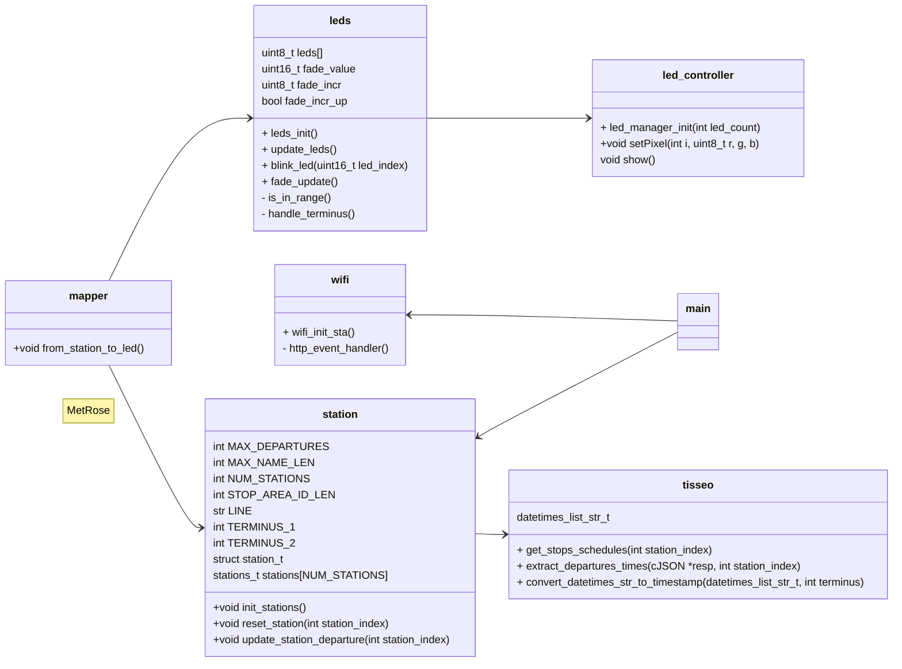

# ESP32 MetRose

## diagramm to do


## To Do
- add stat about api utilisation (nb of call, etc...)

## Use
Create a config.h file in main/ with values:
```C
#pragma once

#define WIFI_SSID "YOUR_WIFI_SSID"
#define WIFI_PASSWORD "YOUR_WIFI_PASSWORD"
```

## Functionnality
### Current functionnality
- api call to get next departures for each station
- 3 state of led: OFF, ON, BLINK

### To Do
- fix terminus bug: we only have departures, no arrival for end of line
- implement fading
- control led intensity/ better led control
- code refactor for resuse later with metro and/or paris

